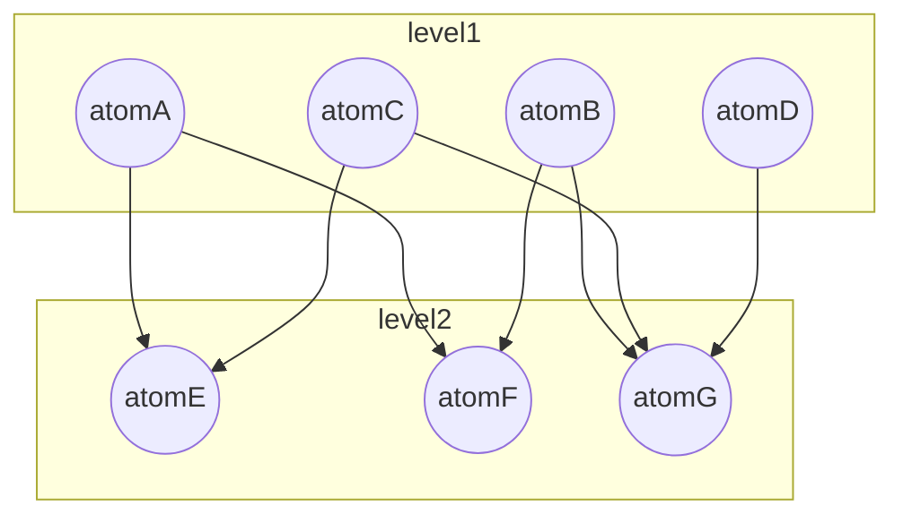
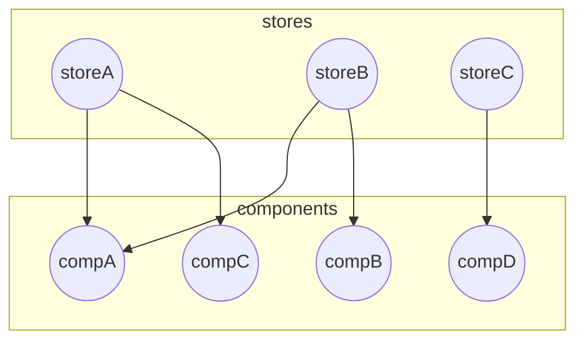

# Jotai / Zustand

本篇專注於討論  jotai, zustand 使用上的思維差異以及什麼場景下適合什麼思考方式，不討論  API 設計的好與壞。


在 jotai 中的一個 [issue](https://github.com/pmndrs/jotai/issues/13) 作者有提到幾個關鍵


> **Where state resides**\
> Jotai state is within React component tree.\
> Zustand state is in the store outside React.


Jotai 狀態是跟 react 掛勾的，所以可能不建議在 React 之外對 atom 作操作。

Zustand 則是將 store 自己管理，更新時會通知 react 元件更新。


> **How to structure state**\
> Jotai state consists of atoms (i.e. bottom-up).
>
> Zustand state is one object (i.e. top-down).


這部份是我們討論的重點，這關乎到如何設計/思考你的架構。

在 Zustand [官方文件](https://docs.pmnd.rs/zustand/getting-started/comparison#jotai)中也有作比較

## Jotai (atom base, bottom-up)

我們利用圖像化來表示 atom base 形式如何組織你的狀態



上圖是 atom 的依賴關係，實際上更複雜也不會只有一層，level1 代表無任何依賴的 atom。透過將整個資訊分割後根據需求各自重組成新的 atom，或是在元件內各自取用。

這也體現了一種思考方式，優先拆分你的資料再組合，提升使用的自由度

## Zustand (top-down)



zustand 思考方式比較不同，如果要重組就在 component 或 custom hook 內作重組，store 本身也是可以切割的再組合 ([slices pattern](https://docs.pmnd.rs/zustand/guides/slices-pattern#slicing-the-store-into-smaller-stores))

但這種切割與 jotai atom 不同，一個 slice 不算是一個 hook，你沒辦法單獨拿來使用，如果一個叫 A 的 slice 存活在某個 store，資料是不能與存活在其他 store 的 A slice 共享，因為實體不同

```javascript
import { create } from 'zustand'
import { createBearSlice } from './bearSlice'
import { createFishSlice } from './fishSlice'

export const useBoundStore = create((...a) => ({
  // 建立一個 bearSlice 的實體，並且是 useBoundStore 獨有的
  ...createBearSlice(...a),
  // 建立一個 fishSlice 的實體，並且是 useBoundStore 獨有的
  ...createFishSlice(...a),
}))

export const useAnotherBoundStore = create((...a) => ({
  // 建立一個 bearSlice 的實體，並且是 useAnotherBoundStore 獨有的
  ...createBearSlice(...a),
  // 建立一個 fishSlice 的實體，並且是 useAnotherBoundStore 獨有的
  ...createFishSlice(...a),
}))

```

## 優缺點

### Jotai

優點

- atom base 本身具有高組合性的特點，在自由度上非常高

- 在程式中，組合相較於切分，心智負擔較低，依賴關係追蹤較容易

- 可整合其他 library

缺點

- atom 會零散的分布，在管理上需要有一套規範

- atom 數量有可能會膨脹過快，所以要依靠開發者自律

適用場景

- 狀態交錯複雜，狀態有各種排列組合，而不只限於某個區域

- 對整個資料關係沒辦法全盤了解的情境（未來可能頻繁新增或刪除）

### Zustand

優點

- 承襲 redux/mobx 的思考邏輯，對大部分工程師使用上較直覺

- 能框住特定功能的狀態及行為(ex. 帳號登入登出)

- 本身不與 react 綁定，在 react 之外操作較容易

缺點

- 以功能劃分 store，一旦專案較多不同功能狀態要交錯組合，在元件/hook層級上會變混亂

- 一旦將 store 劃分後，要修改重新組合相對花的成本更高

適用場景

- 專案功能與功能之間足夠獨立，較少耦合

- 能在開發前就把功能資料及行為有較全面的了解（幾乎不會有大變動）